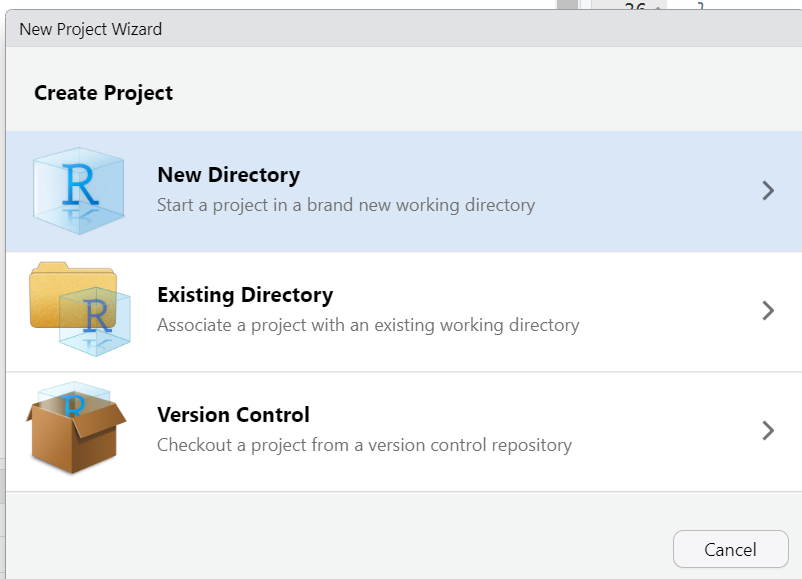
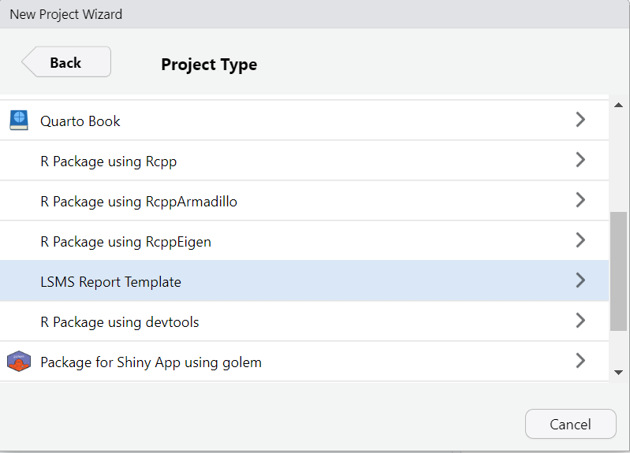
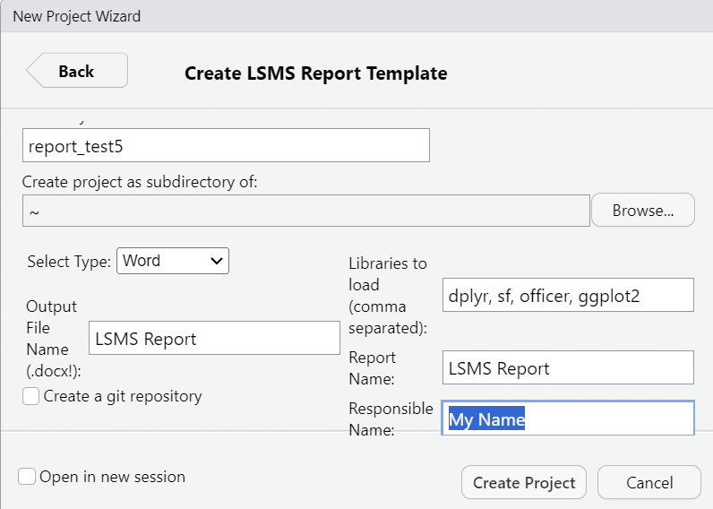
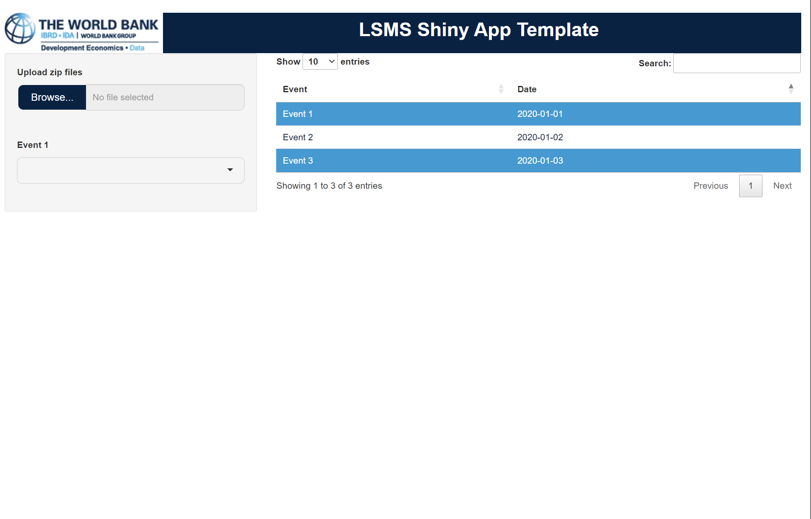

<!-- README.md is generated from README.Rmd. Please edit that file -->

```{r, include = FALSE}
knitr::opts_chunk$set(
  collapse = TRUE,
  comment = "#>",
  fig.path = "man/figures/README-",
  out.width = "100%"
)
```

# LSMS - RStudio Project Template 2: Simple Shiny Application

## Background

<!-- badges: start -->
[](https://lifecycle.r-lib.org/articles/stages.html#experimental)
<!-- badges: end -->

<div align="justify">

This is a preliminary version of a template for LSMS/Survey Solutions simple Shiny Applications. It is based on the [Rstudio project template](https://rstudio.github.io/rstudio-extensions/rstudio_project_templates.html). The main aim of this (and similar templates) is the standardization of the Shiny app creation process, and the increase in reproducibility, in line with the World Bank's reproducible research principles. For more details on the World Bank's approach to reproducible research, please see [here](https://reproducibility.worldbank.org/index.php/home).


## Project set-up

After installing the package, you can create a new project from the template by selecting "File > New Project > New Directory > LSMS Shiny App Template" in Rstudio. You will be asked to provide a project name and a directory where the project should be created. 

<p float="left">
  
   
  
</p>

The project will be created in a new directory with the name you provided. The project directory will contain the following files and directories:


```{r, eval=FALSE, echo=TRUE}
.
├── DESCRIPTION
├── dev
│   └── setup.R
├── inst
│   └── www
│       ├── logoWBDG.png
│       └── styles.scss
├── LICENSE
├── LICENSE.md
├── man
│   └── figures
│       └── susospatial.png
├── myapp.Rproj
├── NAMESPACE
├── R
│   ├── module1.R
│   ├── myapp-package.R
│   ├── runapp.R
│   ├── server.R
│   └── ui.R
└── README.Rmd

```


In addition the template also creates a local **.Rprofile**, with the following content:

```{r, eval=FALSE, echo=TRUE}
# .Rprofile
library("devtools")

```

This will load the package automatically every time the project is opened. Running:

```{r, eval=FALSE, echo=TRUE}
devtools::document()
devtools::load_all()

```

will load the package and make it ready for use. Running the app can be done by:

```{r, eval=FALSE, echo=TRUE}
runMyApp()

```

And (if you haven't added any modules, and have installed the required libraries, which are DT, shiny, sass and waiter) will result in the following Shiny app:

<div align="center">

</div>

Running *devtools::check()* eventually should also result in a successful check without any errors or warnings.

**ATTENTION:** This package is at an early stage of development and will be updated regularly. Please check for updates regularly, and if you have any suggestions or comments, please let me know. One of the next steps will also be the addition of a Power Point template, currently only the word template is available. In addition the Github option, even though available during the project creation process, is not yet fully functional.


## Installation

* Install R: https://cran.r-project.org/mirrors.html (version 4.1.1 or greater)

* Install R Studio: https://rstudio.com/products/rstudio/download/ (version 1.2.5001-3 or newer)

* Make sure the *devtools* package is installed, if not install it with:

```{r devtoolsinst,eval=FALSE, echo=TRUE}
install.packages("devtools")

```


* After that install the actual package:

```{r install,eval=FALSE, echo=TRUE}
devtools::install_github("michael-cw/lsmsrprojtempl2")

```

</div>
